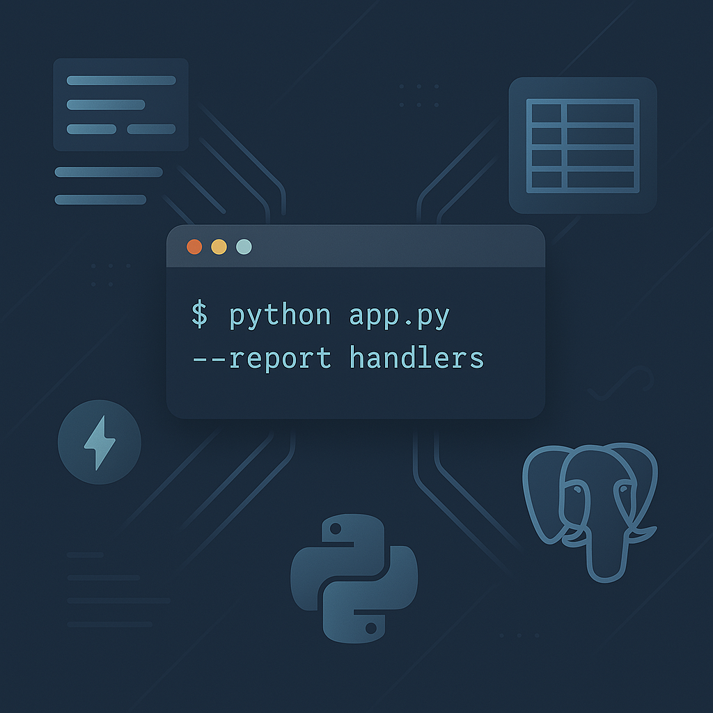
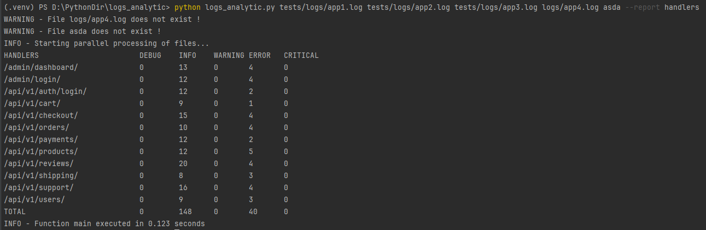
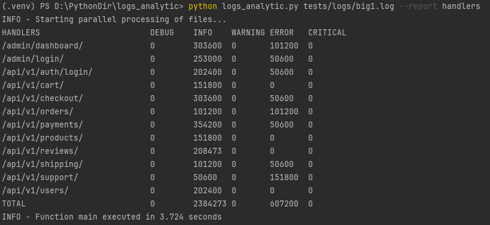
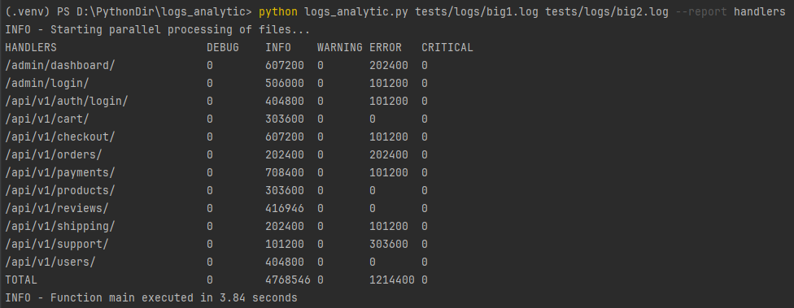
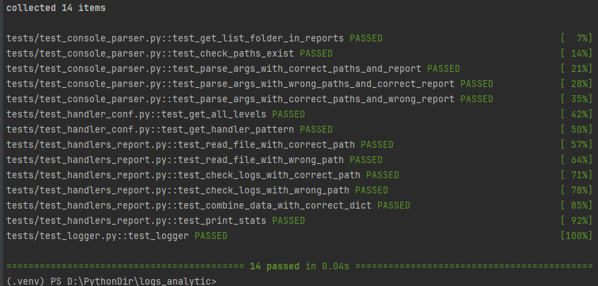
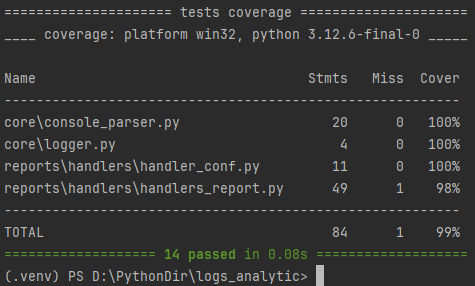

<p align="center">
  
</p>

<h1 align="center">Logs analytic</h1>

## Содержание

- [Описание проекта](#описание-проекта)
- [Стек](#стек)
- [Структура проекта](#структура-проекта)
- [Команда для запуска подсчета лог-файлов](#команда-для-запуска-подсчета-лог-файлов)
- [Примеры использования приложения](#примеры-использования-приложения)
    - [Пример использования приложения на тестовых лог-файлах](#пример-использования-приложения-на-тестовых-лог-файлах)
    - [Пример использования приложения на одном большом файле](#пример-использования-приложения-на-одном-большом-файле-больше-5-000-000-строк)
    - [Пример использования приложения на двух больших файлах](#пример-использования-приложения-на-двух-больших-файлах-больше-10-000-000-строк)
- [Unit-тесты всех функций/методов](#unit-тесты-всех-функцийметодов-)
- [Pytest-cov статистика](#pytest-cov-статистика)
      
## Описание проекта

```bash
Тестовое задание
```

Этот проект представляет собой CLI-приложение, предназначенное для анализа логов Django и формирования отчетов по
API-эндпоинтам. Основные функции включают:

- Парсинг логов Django.
- Генерация статистики по хендлерам API.
- Поддержка масштабируемости через добавление новых отчетов.

Проект использует стандартную библиотеку Python и ориентирован на выполнение операций с большими объемами данных. Он
предоставляет гибкую систему для расширения, добавляя новые типы отчетов и обработки данных.

## Стек

- **Python** — основной язык программирования.
- **argparse** — для парсинга аргументов командной строки.
- **logging** — для логирования ошибок и информации о процессе работы.
- **pytest** — для тестирования кода.
- **pytest-cov** — для получения статистики по тестам

## Структура проекта

```bash
├── logs_analytic.py                # Главный файл для выполнения анализа логов
├── core/
│   ├── console_parser.py           # Модуль для парсинга командной строки
│   ├── logger.py                   # Модуль для настройки логирования
├── reports/
│   ├── handlers/
│   │   ├── handlers_report.py      # Модуль для генерации отчета по хендлерам
├── tests/
│   ├── logs                        # Место хранения тестовых лог файлов
│   ├── test_console_parser.py      # Тесты для всех функций/методов в проекте
│   ├── test_handler_conf.py        # 
│   ├── test_handlers_report.py     # 
│   ├── test_logger.py              # --/--
├── .coveragerc                     # Конфигурация pytest-cov
├── pytest.ini                      # Конфигурация для pytest
├── pyproject.toml                  # Конфигурация проекта
└── poetry.lock                     # Зависимости проекта
```

## Команда для запуска подсчета лог-файлов

```bash
python logs_analytic.py tests/logs/big1.log tests/logs/big2.log --report handlers

'log_paths' = ["tests/logs/big1.log", "tests/logs/big2.log"] 
пути файлов проверяются перед запуском формирования отчета
'--report' = "handlers"
проверяется доступность отчета в пакете reports
```

## Примеры использования приложения

### Пример использования приложения на тестовых лог-файлах



### Пример использования приложения на одном большом файле (больше 5 000 000 строк)



### Пример использования приложения на двух больших файлах (больше 10 000 000 строк)



## Unit-тесты всех функций/методов



## Pytest-cov статистика

